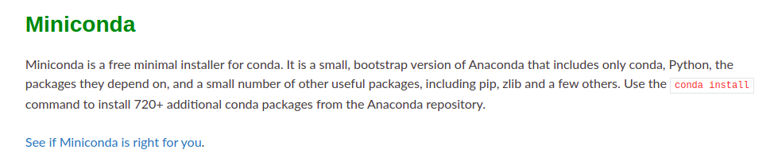
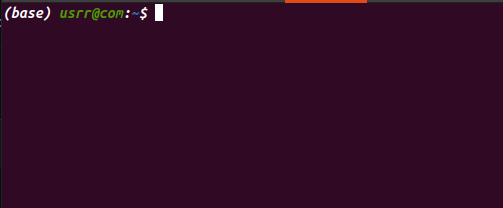
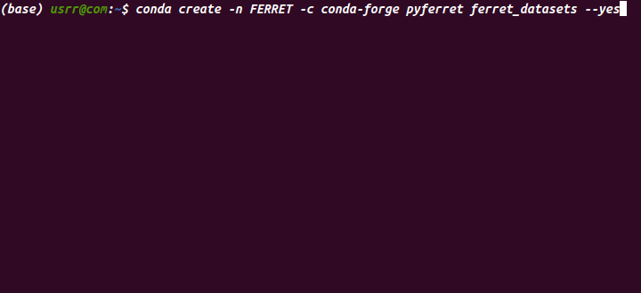
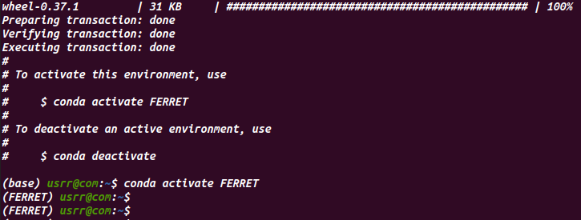
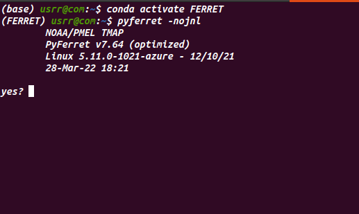

# PyFerret-Installation

## This are the steps to install PyFerret in Windows/linux
1. Install Anaconda or Miniconda
   here, you can download the miniconda installer: https://docs.conda.io/en/latest/miniconda.html\
   
2. Open the conda terminal  
    
4. Write this conde on Terminal and create an environment 'FERRET'. 
    conda create -n FERRET -c conda-forge pyferret ferret_datasets --yes
    
    
4. After installing, go to the environment 'FERRET'. Write this:
    conda activate FERRET 
    
5. Now, type 
      pyferret -nojnl 
      You will get to see it open.
      
  
